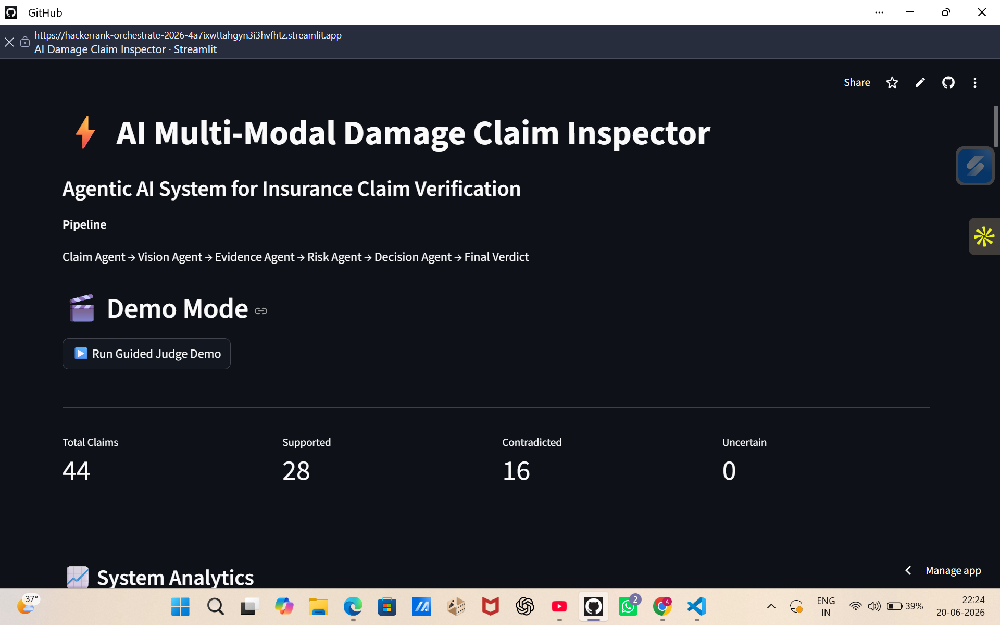
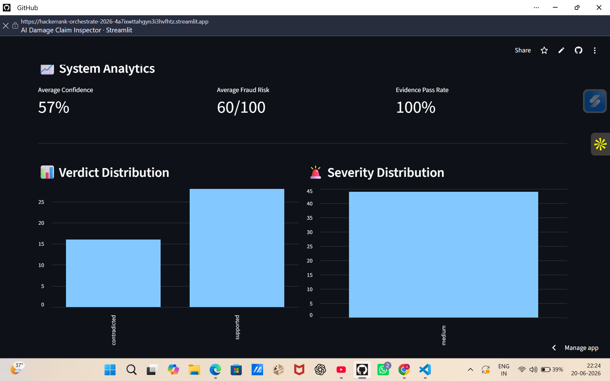
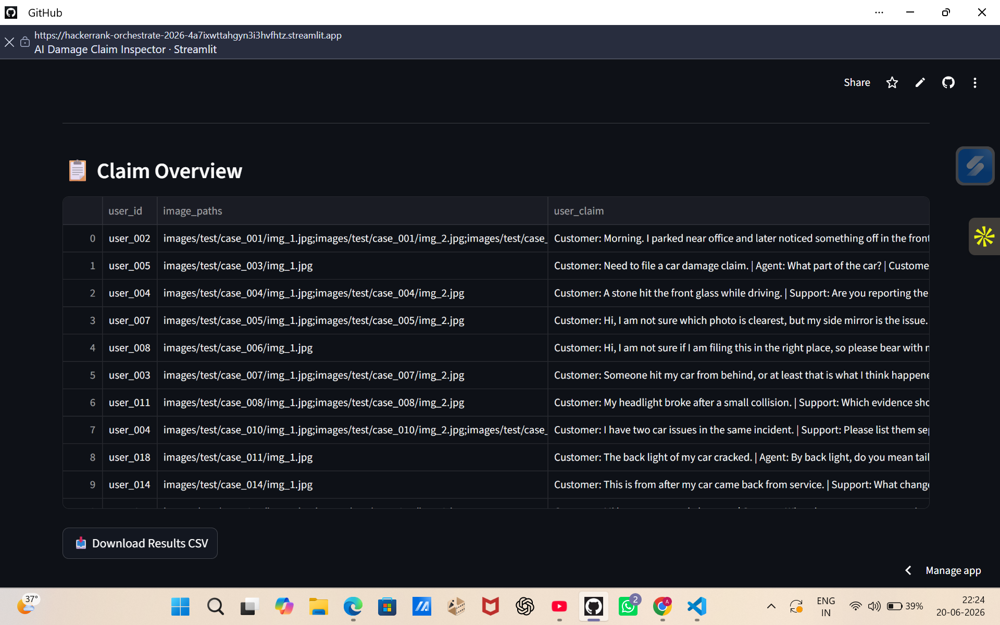
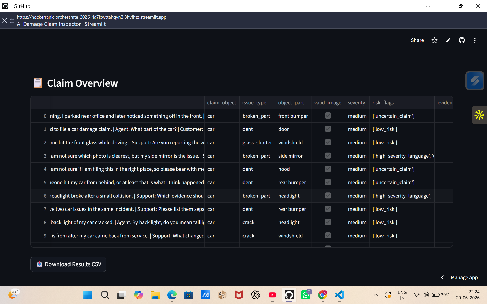
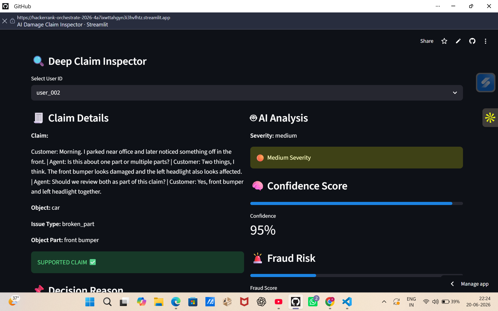
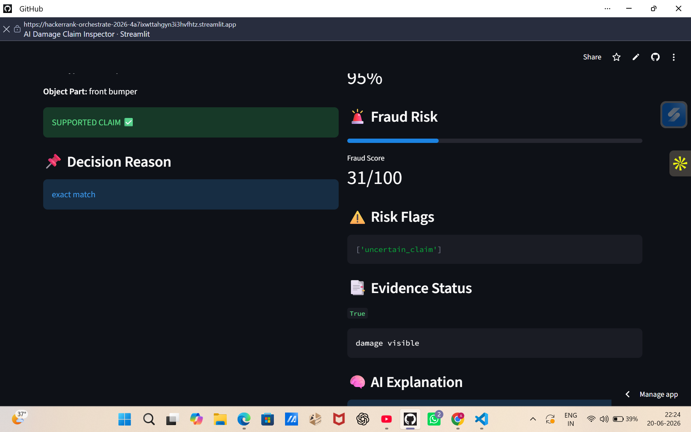
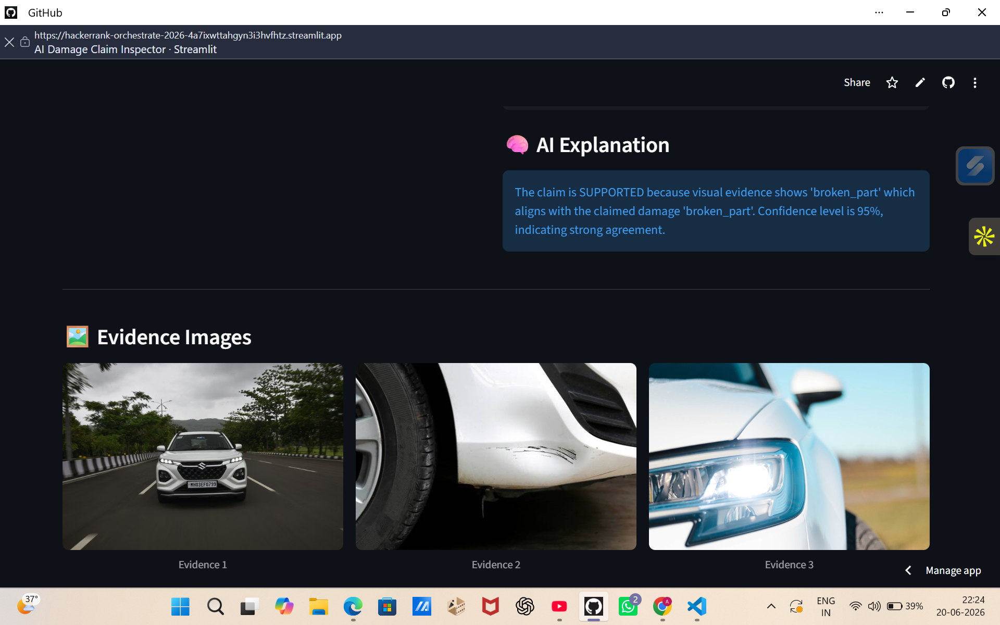
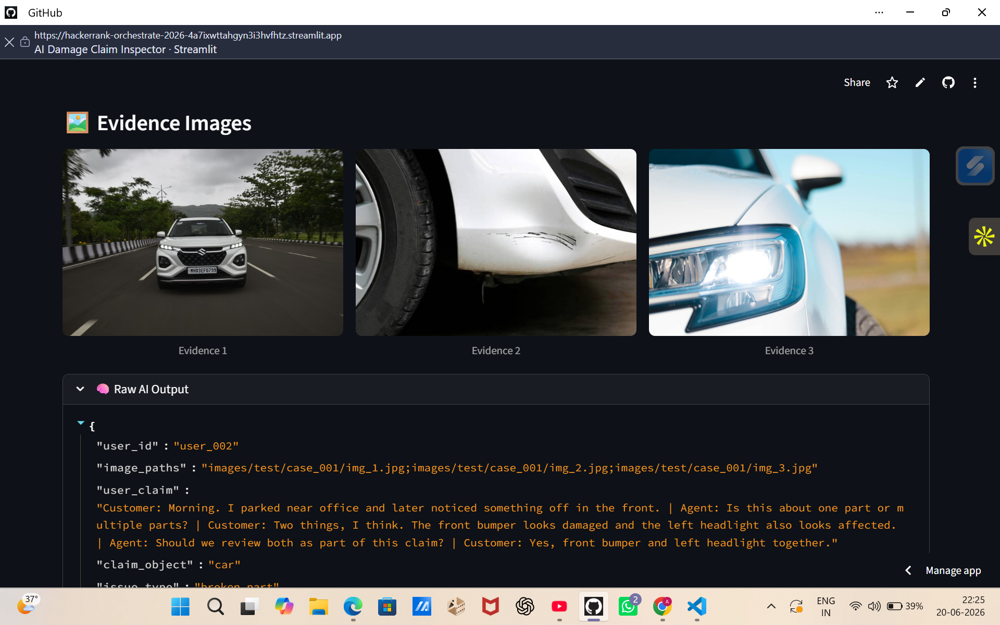
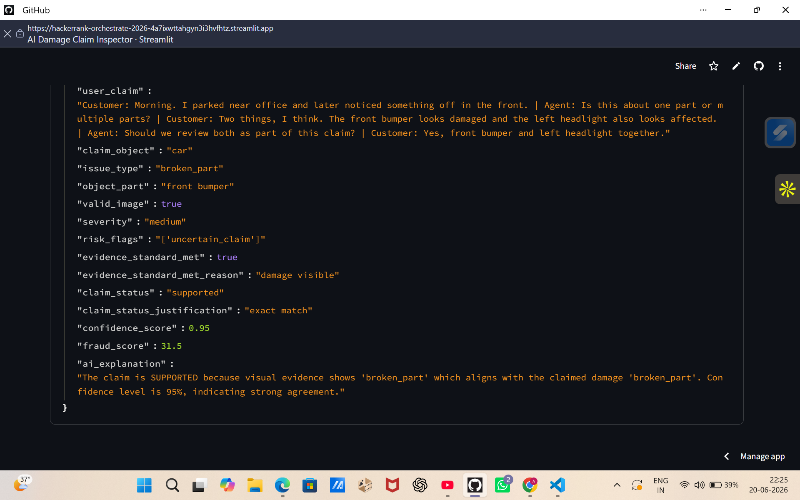

# ⚡ AI Multi-Modal Damage Claim Verification System

### HackerRank Orchestrate 2026 Submission

An Agentic AI system that automates insurance damage claim verification using image evidence, claim understanding, semantic reasoning, fraud risk assessment, and explainable AI.

## 🚀 Live Demo

**Streamlit Deployment:**

https://hackerrank-orchestrate-2026-4a7ixwttahgyn3i3hvfhtz.streamlit.app/

---

##   📸 Screenshots

### Dashboard Overview


### System Analytics


### Claim Overview




### Claim Inspector



### Claim Analysis



### AI Explanation


### Evidence Viewer



### Raw AI Output




## 📌 Problem Statement

Insurance companies process thousands of damage claims every day.

Traditional claim verification requires human reviewers to:

* Inspect uploaded evidence
* Understand customer claims
* Compare visual and textual information
* Detect inconsistencies
* Assess fraud risk

This process is:

* ⏳ Time-consuming
* 💰 Expensive
* 📈 Difficult to scale
* 🚨 Vulnerable to fraudulent claims

The objective of this project is to automate claim verification using an Agentic AI pipeline capable of reasoning across both text and images.

---

## 🏗️ Solution Overview

The system is designed as a multi-agent architecture where each agent performs a specialized task.

### Workflow

```text
User Claim
      ↓
Claim Agent
      ↓
Vision Agent
      ↓
Evidence Agent
      ↓
Risk Agent
      ↓
Decision Agent
      ↓
Confidence Scoring
      ↓
Fraud Scoring
      ↓
Final Verdict
```

The final verdict is generated using both textual and visual evidence.

---

## 🤖 AI Agents

### 1️⃣ Claim Agent

Extracts structured damage information from natural language claims.

**Input**

```text
My car door got dented after an accident.
```

**Output**

```json
{
  "issue_type": "dent",
  "object_part": "door"
}
```

---

### 2️⃣ Vision Agent

Analyzes uploaded images using Gemini Vision.

Extracts:

* Damage type
* Damaged object part
* Severity
* Image validity
* Damage visibility

---

### 3️⃣ Evidence Agent

Evaluates whether the uploaded evidence sufficiently supports the claim.

Checks:

* Damage visibility
* Image validity
* Evidence consistency

---

### 4️⃣ Risk Agent

Identifies suspicious patterns and risk indicators.

Examples:

* Ambiguous claims
* High-risk wording
* Missing evidence
* Manual review triggers

---

### 5️⃣ Decision Agent

Produces one of the following outcomes:

| Verdict                | Description                       |
| ---------------------- | --------------------------------- |
| Supported              | Claim aligns with visual evidence |
| Contradicted           | Claim conflicts with evidence     |
| Not Enough Information | Evidence is insufficient          |

---

## 🧠 Semantic Damage Matching

The system performs semantic reasoning instead of strict keyword matching.

Examples:

```text
dent ≈ deformation
broken_part ≈ missing_part
glass_shatter ≈ crack
```

This improves robustness when claim descriptions and visual outputs use different terminology.

---

## 📊 Key Features

* ✅ Multi-Modal AI (Vision + Text)
* ✅ Agent-Based Architecture
* ✅ Semantic Damage Matching
* ✅ Confidence Scoring
* ✅ Fraud Risk Assessment
* ✅ Explainable AI
* ✅ Streamlit Dashboard
* ✅ Evidence Validation
* ✅ Image Analysis Caching
* ✅ Interactive Claim Inspector

---

## 🖥️ Dashboard Features

The Streamlit application provides:

### 📋 Claim Overview Table

View all processed claims and system decisions.

### 🔍 Deep Claim Inspector

Inspect individual claims with detailed AI analysis.

### 🧠 Confidence Visualization

Displays model confidence for each decision.

### 🚨 Fraud Risk Meter

Shows estimated fraud risk score.

### 🖼️ Evidence Viewer

Displays uploaded claim images.

### 🤖 AI Explanation Engine

Provides human-readable reasoning behind each verdict.

### 🎬 Guided Judge Demo Mode

Walkthrough of the complete AI reasoning pipeline.

---

## 📂 Project Structure

```text
code/
│
├── agents/
│   ├── claim_agent.py
│   ├── vision_agent.py
│   ├── evidence_agent.py
│   ├── risk_agent.py
│   └── decision_agent.py
│
├── cache/
│
├── generate_output.py
├── ui_app.py
├── output.csv
│
dataset/
│
README.md
requirements.txt
```

---


## 🛠️ Technologies Used

### AI & Machine Learning

* Gemini Vision API
* Agentic AI Architecture

### Backend

* Python

### Data Processing

* Pandas

### Frontend

* Streamlit

### Image Processing

* Pillow

---

## 📈 Future Improvements

* Fine-grained severity estimation
* Advanced fraud detection models
* Hybrid vision ensemble models
* Enhanced semantic reasoning
* Multi-image evidence fusion
* Real-time claim processing APIs
* Human-in-the-loop review workflow

---

## 👩‍💻 Author

**Anupriya Ranjan**

Built for **HackerRank Orchestrate 2026**

Exploring Agentic AI, Generative AI, Open Source, and Intelligent Systems.

---

## ⭐ Acknowledgements

This project was developed as part of the HackerRank Orchestrate 2026 challenge to explore the application of Agentic AI systems in insurance claim verification and fraud detection.
